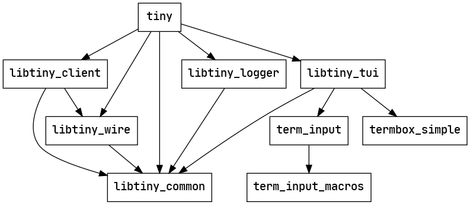

# Architecture

This document describes tiny's high-level architecture, the parts that are
unlikely to change too often. If you are interested in contributing to tiny,
this is the best place to start.

## Crates

tiny consists of 9 crates. The dependencies between these crates are as
follows:

