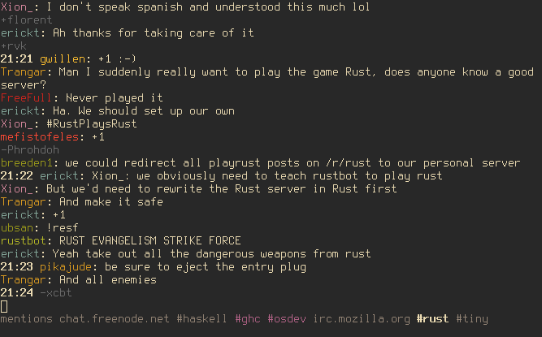

# tiny - Yet another console IRC client

[](https://travis-ci.org/osa1/tiny)
[](./LICENSE)
[](https://crates.io/crates/tiny)

tiny is an IRC client written in Rust.



## Features

- Clean UI: consecutive join/part/quit messages are shown in a single line, time
  stamps for a message is omitted if it's the same as the message before.

- All mentions to the user are collected in a "mentions" tab, including server
  and channel information. "mentions" tab solves the problem of missing mentions
  to you in channels after hours of inactivity.

- Mentions to the user in a channel is highlighted (the channel tab is also
  highlighted in the tab list)

- Simple config file format for automatically connecting to servers, joining
  channels, registering the nickname etc. See [configuration
  section](#configuration) below.

- Nick tab-completion in channels

- Nicks in channels are colored.

- Disconnect detection and automatic reconnects. You can keep tiny running on
  your laptop and it automatically reconnects after a sleep etc.

- Key bindings inspired by terminal emulators and vim. See [key bindings
  section](#key-bindings) below.

## Installation

Install the Rust nightly toolchain, clone the repo, and run `cargo install` (or
`cargo install --force` if you already have an older version installed). There's
currently no way to publish a crate on crates.io without publishing all the
dependencies, so tiny won't be on crates.io for a while.

tiny has been developed and used on Linux. It may work on Darwin, but I don't
have access to a Mac so I can't try. It won't work on Windows as some of the
system calls used in tiny are not available on Windows.

## Configuration

When tiny couldn't find a config file at `~/.tinyrc.yml` it creates one with
some defaults and exits. Edit that file before re-running tiny to change the
defaults. If you want to create the file yourself, the default file looks like
this:

```yaml
# Servers to auto-connect
servers:
    - addr: irc.mozilla.org
      port: 6667
      hostname: yourhost
      realname: yourname
      nicks: [tiny_user]
      auto_cmds:
          - 'msg NickServ identify hunter2'
          - 'join #tiny'

# Defaults used when connecting to servers via the /connect command
defaults:
    nicks: [tiny_user]
    hostname: yourhost
    realname: yourname
    auto_cmds: []

# Where to put log files
log_dir: '/home/user/tiny_logs'
```

## Key bindings

- `C-a`/`C-e` to move cursor beginning/end in the input field

- `C-k` for deleting rest of the line

- `C-w` for deleting a word

- `C-left`/`C-right` for moving one word backward/forward

- `page up`/`page down` or `shift-up`/`shift-down` or  for scrolling

- `C-n`/`C-p` for next/previous tab

- `C-c enter` to quit.

## Commands

Commands start with `/` character.

- `/msg <nick> <message>`: Send a message to a user. Creates a new tab.

- `/join <channel>`: Join to a channel

- `/close`: close the current tab. Leaves the channel if the current tab is a
  channel. Leaves the server if the tab is a server.

- `/connect <hostname>:<port>`: Connect to a server. Uses `defaults` in the
  config file for nick, realname, hostname and auto cmds.

- `/connect`: Reconnect to the current server. Use if you don't want to wait
  tiny to reconnect automatically after a connectivity problem.

## Development

tiny is in early stages of development. Some of features that you might think
are essential may be missing. Please open an issue for those features (or even
better, a pull request!).

Being a Rust n00b, I spent a lot of time trying to convince borrow checker,
failing at that, and either adding bunch of ugly hacks (e.g. instead a loop that
modifies single element implementing a loop that finds an index and modifying
that index after the loop), or using a simpler but less efficient code (e.g.
cloning things redundantly to avoid borrow checking). Still, I think the
connection manager (`conn.rs`) and UI parts (`tui` module) are not too bad.
Mess is mostly in `lib.rs` which implements the main logic (command and message
handling etc.).

Any suggestions / code reviews / pull requests are very welcome!

If you're looking to contribute, see TODOs below. If you don't know where to
start, open an issue and I'd love to help.

## TODOs

- Paste events are currently ignored. A simple paste support that just sends
  whatever is in the clipboard could be implemented in a few lines of code, but
  we should probably be careful with sending long message and messages with
  newlines in it. I'm thinking maybe in these cases we should open up `$EDITOR`
  and let the user see and edit what they're pasting.

- Logging should be improved. Currently messages are logged in raw form in
  `<log dir>/server_raw.log`, but outgoing message are not logged. Channel logs
  are printed in a weird format etc.

- Colors are not easily configurable. All colors are specified in `config.rs`
  but that requires recompiling tiny after a change. We should move colors
  config to the configuration file. (and maybe even implement a "reload" command
  to live reloading color changes)

- SSL support

- There's currently no way to see all nicks in a channel. (currently to see if
  someone's online in a channel you can do `<nick><TAB>` and see if auto
  completion works)

- Sockets are immediately read when they're ready for reading, but for writing
  we don't check if they're ready for writing. Thus, if you try to spam a
  channel or something, you'd probably get a `EAGAIN` and tiny would interpret
  that as a connectivity problem and try to reconnect. We should buffer outgoing
  messages and only send them when the socket is ready for writing.

- Only a small subset of IRC messages are implemented. I don't moderate
  channels, so my needs are simple. For moderation commands or other commands
  that tiny currently doesn't support, maybe we should implement a "send raw
  message" command so that any user can directly send an IRC message to a server
  without any support from tiny.

- Implement away mode

- Implement system notification support for private messages and highlights.
  When to show (and maybe even how to show) a notification should be
  configurable as otherwise it may be annoying.
