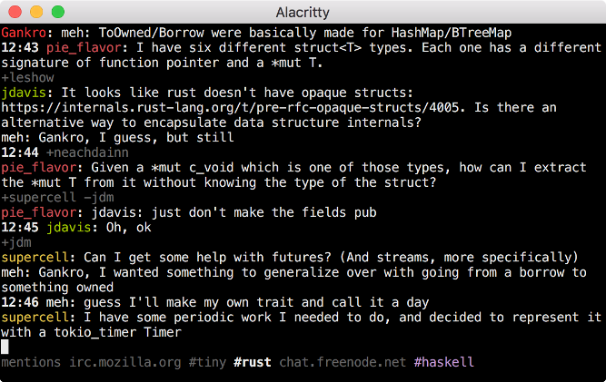

# tiny - Yet another console IRC client

[](https://travis-ci.org/osa1/tiny)
[](./LICENSE)
[](https://crates.io/crates/tiny)

tiny is an IRC client written in Rust.




## Features

- Clean UI: consecutive join/part/quit messages are shown in a single line, time
  stamps for a message is omitted if it's the same as the message before.
  (inspired by [irc-core](https://github.com/glguy/irc-core))

- All mentions to the user are collected in a "mentions" tab, including server
  and channel information. "mentions" tab solves the problem of missing mentions
  to you in channels after hours of inactivity.

- Mentions to the user in a channel is highlighted (the channel tab is also
  highlighted in the tab list)

- Simple config file format for automatically connecting to servers, joining
  channels, registering the nickname etc. See [configuration
  section](#configuration) below.

- Nick tab-completion in channels

- Nicks in channels are colored.

- Disconnect detection and automatic reconnects. You can keep tiny running on
  your laptop and it automatically reconnects after a sleep etc.

- Key bindings inspired by terminal emulators and vim. See [key bindings
  section](#key-bindings) below.

- Configurable colors

- SASL authentication

- Configurable desktop notifications on new messages

- znc compatible

## Installation

Install the Rust nightly toolchain, clone the repo, and run `cargo install` (or
`cargo install --force` if you already have an older version installed).

Arch Linux users can install tiny from the
[AUR](https://aur.archlinux.org/packages/tiny-irc-client-git/). Note
that the supported way to meet the rust-nightly dependency is with the
official
[Rustup](https://www.archlinux.org/packages/community/x86_64/rustup/)
package, but you can alternatively install Rustup via the [Rust
Toolchain
Installer](https://www.rust-lang.org/en-US/install.html). Either way, remember to
install the Rust nightly toolchain before running makepkg.

Since version 0.3.0 tiny needs OpenSSL or LibreSSL headers and runtime
libraries. See [rust-openssl's
README](https://github.com/sfackler/rust-openssl#linux) for instructions on
installing them.

##### Dependencies

* OpenSSL or LibreSSL
* libdbus [Linux only]

tiny is tested on Linux and OSX.

## Configuration

When tiny couldn't find a config file at `~/.tinyrc.yml` it creates one with
some defaults and exits. Edit that file before re-running tiny to change the
defaults. If you want to create the file yourself, the default file looks like
this:

```yaml
# Servers to auto-connect
servers:
    - addr: irc.mozilla.org
      port: 6697
      # Optional field, defaults to false:
      tls: true
      # Optional field for server password:
      # pass: 'server_pass'
      hostname: yourhost
      realname: yourname
      nicks: [tiny_user]

      # Optional SASL authentication
      # sasl:
      #   username: 'tiny_user'
      #   password: 'hunter2'

      # Channels to automatically join
      join:
          - '#tiny'
          - '#rust'

      # Optional password to identify via NickServ
      # nickserv_ident: 'hunter2'

# Defaults used when connecting to a server via the /connect command
defaults:
    nicks: [tiny_user]
    hostname: yourhost
    realname: yourname
    join: []

# Where to put log files
log_dir: '/home/$USER/tiny_logs'

# <Color scheme configuration>
```

**A note on nick identification:** Some IRC servers such as ircd-seven (used by
Freenode) and InspIRCd (used by Mozilla) support identification via the `PASS`
command. This way of identification (rather than sending a message to a service
like `NickServ`) is better when some of the channels that you automatically
join require identification. To use this method enter your nick password to the
`pass` field in servers.

## Command line arguments

By default (i.e. when no command line arguments passed) tiny connects to all
servers listed in the config. tiny considers command line arguments as patterns
to be matched in server addresses, so you can pass command line arguments to
connect to only a subset of servers specified in the config. For example, in
this config:

```yaml
servers:
    - addr: irc.mozilla.org
      ...

    - addr: chat.freenode.net
      ...
```

By default tiny connects to both servers. You can connect to only the second
server by passing `freenode` as a command line argument.

You can use `--config <path>` to specify your config file location.

## Key bindings

- `C-a`/`C-e` to move cursor beginning/end in the input field

- `C-k` for deleting rest of the line

- `C-w` for deleting a word

- `C-left`/`C-right` for moving one word backward/forward

- `page up`/`page down` or `shift-up`/`shift-down` or  for scrolling

- `C-n`/`C-p` for next/previous tab

- `C-c enter` to quit.

- `alt-{1,9}` switch to nth tab

- `alt-{char}` switch to next tab with underlined `char`

- `alt-0` switch to last tab

- `alt-left/right` move tab to left/right

## Commands

Commands start with `/` character.

- `/msg <nick> <message>`: Send a message to a user. Creates a new tab.

- `/join <channel>`: Join to a channel

- `/close`: Close the current tab. Leaves the channel if the current tab is a
  channel. Leaves the server if the tab is a server.

- `/connect <hostname>:<port>`: Connect to a server. Uses `defaults` in the
  config file for nick, realname, hostname and auto cmds.

- `/connect`: Reconnect to the current server. Use if you don't want to wait
  tiny to reconnect automatically after a connectivity problem.

- `/away <msg>`: Set away status

- `/away`: Remove away status

- `/nick <nick>`: Change nick

- `/names`: List all nicks in the current channel. You can use `/names <nick>` to
  check if a specific nick is in the channel.

- `/reload`: Reload configuration

- `/clear`: Clears tab contents

- `/switch <string>`: Switch to the first tab which has the given string in the name.

- `/ignore`: Ignore `join/quit` messages in a channel. When enabled channel
  name will have `[i]` added to the end to show that it is enabled. Running
  this command in a server tab applies it to all channels of that server.

- `/notify [off|mentions|messages]`: Enable and disable desktop notifications.
  You can use `/notify` command without any arguments to see the current mode.
  Running this command in a server tab applies it to all channels of that server.

## Development

tiny is in early stages of development. Some of features that you
might think are essential may be missing. Please open an issue for
those features (or even better, a pull request!). Remember to add
yourself to the [list of contributors](#contributors) if you submit a
pull request.

Being a Rust n00b, I spent a lot of time trying to convince borrow checker,
failing at that, and either adding bunch of ugly hacks (e.g. instead a loop that
modifies single element implementing a loop that finds an index and modifying
that index after the loop), or using a simpler but less efficient code (e.g.
cloning things redundantly to avoid borrow checking). Still, I think the
connection manager (`conn.rs`) and UI parts (`tui` module) are not too bad.
Mess is mostly in `lib.rs` which implements the main logic (command and message
handling etc.).

Any suggestions / code reviews / pull requests are very welcome!

If you're looking to contribute, see TODOs below. If you don't know where to
start, open an issue and I'd love to help.

## TODOs

- Paste events are ignored when string includes newline characters (`\n`). It'd
  be nice to use $EDITOR for editing multi-line pastes before sending.

- Logging should be improved. Currently messages are logged in raw form in
  `<log dir>/server_raw.log`, but outgoing message are not logged. Channel logs
  are printed in a weird format etc.

- Only a small subset of IRC messages are implemented. I don't moderate
  channels, so my needs are simple. For moderation commands or other commands
  that tiny currently doesn't support, maybe we should implement a "send raw
  message" command so that any user can directly send an IRC message to a server
  without any support from tiny.

## Contributors

[Ömer Sinan Ağacan](https://github.com/osa1)

[Abin Simon](https://github.com/meain)

[Umur Gedik](https://github.com/umurgdk)

[Chiu Yue Chun](https://github.com/BrianOn99)

[@wammies](https://github.com/wammies)

[Nick Econopouly](https://github.com/wrycode)
